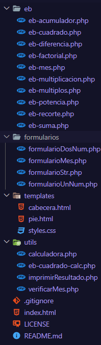
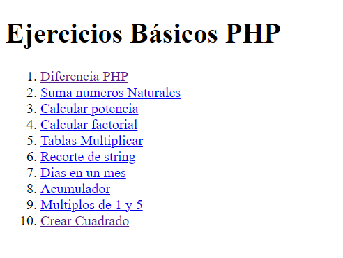
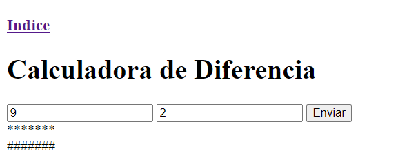
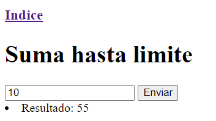
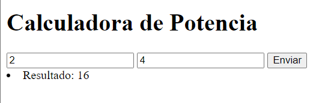
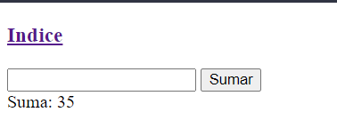
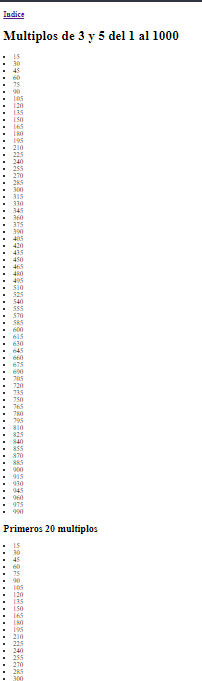
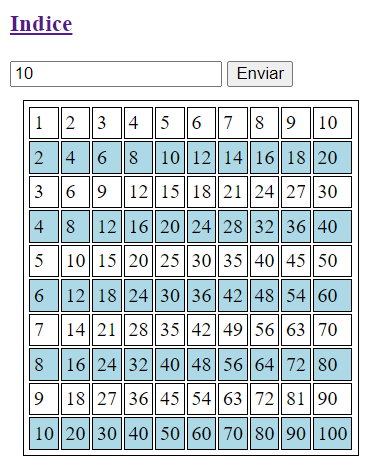

# Ejecicios básicos de PHP

## Estructura del proyecto
- La carpeta (/eb) se encuentran los index de cada uno de los ejercicios, donde se estrucutura la página.

- La carpeta fomularios tengo distintos formularios que mediante includes los puedo reutilizar en cada ejercicio

- La carpeta template estan la cabecera, pie y hoja de estilos para poder replicar en cada ejercicio

- La carpeta de utils que su principal función es tener la parte lógica y de vista de los ejercicios. 

- El archivo index.html que es el punto de partida para desplazarse por los distintos ejercicios




## Index.html

``` html
<!DOCTYPE html>
<html lang="en">
<head>
    <meta charset="UTF-8">
    <meta name="viewport" content="width=device-width, initial-scale=1.0">
    <title>Document</title>
</head>
<body>
    <h1>Ejercicios Básicos PHP</h1>
    <ol>
        <li><a href="./eb/eb-diferencia.php">Diferencia PHP</a></li>
        <li><a href="./eb/eb-suma.php">Suma numeros Naturales</a></li>
        <li><a href="./eb/eb-potencia.php">Calcular potencia</a></li>
        <li><a href="./eb/eb-factorial.php">Calcular factorial</a></li>
        <li><a href="./eb/eb-multiplicacion.php">Tablas Multiplicar</a></li>
        <li><a href="./eb/eb-recorte.php">Recorte de string</a></li>
        <li><a href="./eb/eb-mes.php">Dias en un mes</a></li>
        <li><a href="./eb/eb-acumulador.php">Acumulador</a></li>
        <li><a href="./eb/eb-multiplos.php">Multiplos de 1 y 5</a></li>
        <li><a href="./eb/eb-cuadrado.php">Crear Cuadrado</a></li>
    </ol>
</body>
</html>
```
Permite únicamente desplazarse por los distintos ejercicios



## Carpeta /templates
### cabecera.html
```html
<!DOCTYPE html>
<html lang="en">
<head>
    <meta charset="UTF-8">
    <meta name="viewport" content="width=device-width, initial-scale=1.0">
    <link rel="stylesheet" href="../templates/styles.css">
    <title>Document</title>
</head>
<body>
    <h3><a href="../index.html">Indice</a></h3>
```
Lo único que comentar sería que esta redirigido al archivo de styles.css y que he agregado un boton para redirigirse al index

### pie.html
```html
    </body>
</html>
```
Simple para cerrar el archivo html

### styles.css
```css
.par{
    border: 1px black solid;
    background-color: lightblue;
    padding: 3px;
}
.impar{
    border: 1px black solid;
    padding: 3px;
}

#tabla{
    border: 1px black solid;
    padding: 3px;
    margin: 10px;
}
```

Estilos para los ejercicios

## eb-diferencia
```php
<?php
    include "../templates/cabecera.html";
    include "../utils/imprimirResultado.php";
    
    use function imprimirResultado\crearAlmohadillas;
    use function imprimirResultado\crearAsteriscos;
    
    echo "<h1>Calculadora de Diferencia</h1>";
    include "../formularios/formularioDosNum.php";    

    if(isset($_POST[PRIMER_NUMERO]) && isset($_POST[SEGUNDO_NUMERO])){
        $primerNumero = $_POST[PRIMER_NUMERO];
        $segundoNumero = $_POST[SEGUNDO_NUMERO];
        if (1 <= $primerNumero && $primerNumero <= 10 &&
             1 <= $segundoNumero && $segundoNumero <= 10){
            $diferencia = $primerNumero - $segundoNumero;
            crearAsteriscos($diferencia);
            crearAlmohadillas($diferencia);
        }
        else
            echo "Introduce numeros entre el 1 y 10";
    }

    include "../templates/pie.html";
?>
```
En un principio añadimos el formulario de dos numeros

```php
<?php
    const PRIMER_NUMERO = "primerNumero";
    const SEGUNDO_NUMERO = "segundoNumero";
?>

<form action="<?php echo htmlspecialchars($_SERVER['PHP_SELF'], ENT_QUOTES, "UTF-8" );?>" method="post">
    <input type="number" name=<?=PRIMER_NUMERO?>>
    <input type="number" name=<?=SEGUNDO_NUMERO?>>
    <input type="submit" value="Enviar">
</form>
```
Posteriormente hago la diferencia de numeros y llamo a dos funciones para crear la vista del ejercicio en imprimirResultado.

```php
<?php
    namespace imprimirResultado;
    CONST TAG_SALTO_LINEA = "<br>";

    function crearAsteriscos($diferencia){
        $index = 1;

        while($index <= $diferencia){
            echo "*";
            $index++;
        }
        echo TAG_SALTO_LINEA;
    }
    
    function crearAlmohadillas($diferencia){
        for ($i=1; $i <= $diferencia; $i++) { 
            echo "#";
        }
        echo TAG_SALTO_LINEA;
    }
    ?>
```

Y en el navegador sería



## eb-suma
```php
<?php
    include "../templates/cabecera.html";
    include "../utils/imprimirResultado.php";
    include "../utils/calculadora.php";
    
    use function calculadora\sumarNumerosNaturales as sumar;
    use function imprimirResultado\printearResultado;
    
    echo "<h1>Suma hasta limite</h1>";
    
    include "../formularios/formularioUnNum.php";
    if(isset($_POST[NUMERO_INPUT])){
        $limite = $_POST[NUMERO_INPUT];
        $resultado = sumar($limite);
        printearResultado($resultado);
    }else{
        echo "Introduce Limite";
    }
    include "../templates/pie.html";
?>
```
Sería el index y luego el formulario de un numero
```php
<?php
    CONST NUMERO_INPUT = "numeroInput";
?>

<form action="<?php echo htmlspecialchars($_SERVER['PHP_SELF'], ENT_QUOTES, "UTF-8" );?>" method="post">
    <input type="number" name="<?=NUMERO_INPUT?>" required>
    <input type="submit" value="Enviar">
</form>
```
La función para sumar:

```php
    function sumarNumerosNaturales($limite): int{
        $resultado = 0;
        for($i = 1; $i <= $limite; $i++)
            $resultado += $i;
        return $resultado;
    }
```
La función para printear resultado:

```php
    CONST TAG_LI_A = "<li>";
    CONST TAG_LI_C = "</li>";
    function printearResultado($resultado){
        echo TAG_LI_A."Resultado: ".$resultado.TAG_LI_C;
    }

```

Vista navegador


## eb-potencia
```php
<?php
    include "../templates/cabecera.html";
    include "../utils/imprimirResultado.php";
    include "../utils/calculadora.php";
    
    use function calculadora\calcularPotencia;
    use function imprimirResultado\printearResultado;
    
    echo "<h1>Calculadora de Potencia</h1>";
    
    include "../formularios/formularioDosNum.php";
    if(isset($_POST[PRIMER_NUMERO]) && isset($_POST[SEGUNDO_NUMERO])){
        $base = $_POST[PRIMER_NUMERO];
        $exponente = $_POST[SEGUNDO_NUMERO];
        $resultado = calcularPotencia($base, $exponente);
        printearResultado($resultado);
    }

?>
```

El formulario es el mismo que hemos utilizado anteriormente y la impresión del resultado, lo único diferente sería la función calcularPotencia.

```php
    function calcularPotencia($base, $exponente): int{
        $resultado = 0;
        for($index = 1; $index <= $exponente; $index++){
            $resultado += $base * $base;
        }
        return $resultado;
    }
```
Vista del ejercicio



## eb-factorial

```php
<?php
    include "../templates/cabecera.html";
    include "../utils/calculadora.php";
    include "../utils/imprimirResultado.php";

    use function imprimirResultado\printearResultado;
    use function calculadora\calcularFactorial;
    
    echo "<h1>Calculadora de Factorial</h1>";
    include "../formularios/formularioUnNum.php";

    if(isset($_POST[NUMERO_INPUT])){
        $res = calcularFactorial($_POST[NUMERO_INPUT]);
        printearResultado($res);
    }else
        echo "Introduce un numero";
    include "../templates/pie.html";

?>
```
Aqui utilizamos las mismas funciones de imprimir resultado y el formulario de un numero. Utilizamos una nueva que sería calcular factorial:

```php
    function calcularFactorial($num): int{
        $res = 1;
        for ($i=1; $i <= $num; $i++) { 
            $res *= $i;
        }
        return $res;
    }
```

Vista del ejercicio


## eb-multiplicacion
```php
<?php
    include "../templates/cabecera.html";
    include "../utils/calculadora.php";
    include "../utils/imprimirResultado.php";

    use function calculadora\calcularTablasMult;
    use function imprimirResultado\printearTablaMult;

    echo "<h1>Tablas de Multiplicar</h1>";
    include "../formularios/formularioUnNum.php";
    if(isset($_POST[NUMERO_INPUT])){
        $num = $_POST[NUMERO_INPUT];
        $resultado = calcularTablasMult($num);
        printearTablaMult($resultado, $num);
    }else
        echo "Introduce numero";
?>
```
En este reutilizo el formulario de un numero, pero al printerar utilizamos una función nueva y otra para calcular las tablas de multiplicar

Calcular tablas de multiplicar:
```php
    CONST FINAL_TABLA_MULTIPLICAR = 10;
    function calcularTablasMult($num): array{
        $res = [];
        for ($i=1; $i <= FINAL_TABLA_MULTIPLICAR; $i++) { 
            $res[$i] = $num * $i;
        }
        return $res;
    }
```
El resultado se mete en un array y se retorna posteriomente en la vista se recorre y para sacar el numero por el que se multiplica se suma 1 al indice del array.

Vista de tablas de multiplicar

```php
    CONST TAG_SALTO_LINEA = "<br>";

    function printearTablaMult($resultado, $num){
        for ($i=0; $i < count($resultado); $i++) { 
            echo $num." x ".($i + 1)." = ".$resultado[$i].TAG_SALTO_LINEA;
        }
    }
```

Vista del ejercicio


## eb-recorte
```php
<?php
    include "../templates/cabecera.html";
    include "../utils/imprimirResultado.php";
    
    use function imprimirResultado\imprimirString;
    
    echo "<h1>Imprimir String</h1>";
    include "../formularios/formularioStr.php";

    if(isset($_POST[STRING_INPUT])){
        imprimirString($_POST[STRING_INPUT]);
    }else
        echo "Introduce String";
?>
```

Utilizamos el formulario de str que es para el uso de strings:

```php
<?php
    CONST STRING_INPUT = "stringInput";
?>
<form action="<?php echo htmlspecialchars($_SERVER['PHP_SELF'], ENT_QUOTES, "UTF-8" );?>" method="post">
    <input type="name" name="<?=STRING_INPUT?>" required>
    <input type="submit" value="Enviar">
</form>
```

Y la función para imprimir la string
```php
    CONST TAG_SALTO_LINEA = "<br>";

    function imprimirString($str){
        for ($i=0; $i < strlen($str); $i++) { 
            for ($t=0; $t < strlen($str) - $i; $t++) { 
                echo $str[$t]; 
            }
            echo TAG_SALTO_LINEA;
        }
    }
```
Vista del ejercicio


## eb-mes
```php
<?php
    include "../templates/cabecera.html";
    include "../utils/verificarMes.php";

    use function verificarMes\imprimirMes;
    
    echo "<h1>Imprimir Mes</h1>";
    include "../formularios/formularioMes.php";
    if(isset($_POST[MES_INPUT])){
        $mes = $_POST[MES_INPUT];
        $bisiesto = "no";
        if(isset($_POST[BISIESTO_INPUT]))
            $bisiesto = $_POST[BISIESTO_INPUT];
        imprimirMes($mes, $bisiesto);
    }
    include "../templates/pie.html";
?>
```
Utilizamos el formulario del Mes

```php
<?php
    CONST MES_INPUT = "mesInput";
    CONST BISIESTO_INPUT = "bisiesto";
?>

<form action="" method="post">
    <input type="text" name="<?=MES_INPUT?>">
    <input type="radio" name="<?=BISIESTO_INPUT?>" value="si"> Bisiesto
    <input type="submit" value="Enviar">
</form>
```

Luego utilizo la función imprimir mes
```php
<?php
    namespace verificarMes;

    function imprimirMes($mesElegido, $bisiesto){
        $mesesDias =[
            "enero" => 31,
            "febrero" => ($bisiesto == "si") ? 29 : 28,
            "marzo" => 31,
            "abril" => 30,
            "mayo" => 31,
            "junio" => 30,
            "julio" => 31,
            "agosto" => 31,
            "septiembre" => 30,
            "octubre" => 31,
            "noviembre" => 30,
            "diciembre" => 31,
        ];
        if(array_key_exists($mesElegido, $mesesDias)){
            echo "<p>El mes $mesElegido tiene ".$mesesDias[strtolower($mesElegido)]." días. </p>";
            echo "<p>El año es " . (($bisiesto == "si") ? "bisiesto." : "no bisiesto.") . "</p>";
        }
        else {
            echo "Introduce un mes válido";
        }
    }
?>
```

Vista del ejercicio


## eb-acumulador
```php
<?php
    include "../templates/cabecera.html";

    CONST NUMERO_INPUT = "numeroInput";

    function sumarNumeros($numero, $suma){
        $numero = intval($numero);
        $suma += $numero;
        return $suma;
    }

    $suma = isset($_POST['suma']) ? $_POST['suma'] : 0;
    if(isset($_POST[NUMERO_INPUT]))
    {
        $numero = $_POST[NUMERO_INPUT];
        $suma = sumarNumeros($numero, $suma);
    }

    if ($suma > 50)
        echo "Suma: ".$suma;
    else{

?>

    <form action="<?php echo htmlspecialchars($_SERVER['PHP_SELF'], ENT_QUOTES, "UTF-8" );?>" method="post">
        <input type="number" name="<?=NUMERO_INPUT?>" required>
        <input type="hidden" name="suma" value="<?php echo $suma; ?>"> 
        <button type="submit">Sumar</button>
    </form>
<?php
        echo "Suma: ".$suma;
    }
    include "../templates/pie.html";
?>
```
En este ejercicio utilizo un formulario que se va a ir sumando hasta que llegue a 50, una vez llegue a 50 se imprime la suma y se acaba el ejercicio.

Vista del ejercicio


## eb-multiplos
```php
<?php
    include "../templates/cabecera.html";
    echo "<h1>Multiplos de 3 y 5 del 1 al 1000</h1>";
    CONST TOPE = 20;
    CONST TAG_LI_O = "<li>";
    CONST TAG_LI_C = "</li>";
    for ($i=1; $i <= 1000; $i++) { 
        if($i % 3 == 0 && $i % 5 == 0)
            echo "<li>$i</li>";
    }

    echo "<h2>Primeros 20 multiplos</h2>";
    $count = 0;
    for ($i=1; $i < 1000; $i++) { 
        if($i % 3 == 0 && $i % 5 == 0){
            echo TAG_LI_O.$i.TAG_LI_C;
            $count++;
        }
        if($count == TOPE)
            break;
    }
    include "../templates/pie.html";
?>
```
Calculo de todos los multiplos de 3 y 5 del 1 al 1000 y luego los primeros 20 multiplos.

Vista del ejercicio


## eb-cuadrado
```php
<?php
    include "../templates/cabecera.html";
    include "../utils/eb-cuadrado-calc.php";
    include "../formularios/formularioUnNum.php";

    use function calcularCuadrado\crearCuadrado;

    if(isset($_POST[NUMERO_INPUT]))
    {
        $numero = $_POST[NUMERO_INPUT];
        crearCuadrado($numero);
    }
    else
        echo "Introduce un Numero";

    include "../templates/pie.html";
?>
```
En este ejercicio utilizo el formulario de un numero y la función crear cuadrado

```php
<?php
    namespace calcularCuadrado;

    CONST TABLE_A = "<table id='tabla'>";
    CONST TABLE_C = "</table>";
    CONST TAG_TR_A = "<tr>";
    CONST TAG_TR_C = "</tr>";
    CONST TAG_TD_C = "</td>";
    CONST TAG_TD_A = "<td class='impar'>";
    CONST TAG_TD_A_BLUE = "<td class='par'>";


    function crearCuadrado(int $num){
        $res = 0;
        echo TABLE_A;
        for ($i=1; $i <= $num; $i++) {
            echo TAG_TR_A;
            for($j=1; $j <= $num; $j++){
                $res = $i * $j;
                if($i % 2 == 0)
                    echo TAG_TD_A_BLUE.$res.TAG_TD_C;
                else
                    echo TAG_TD_A.$res.TAG_TD_C;
            }
            echo TAG_TR_C;
        }
        echo TABLE_C;
    }

?>
```
Vista del ejercicio


